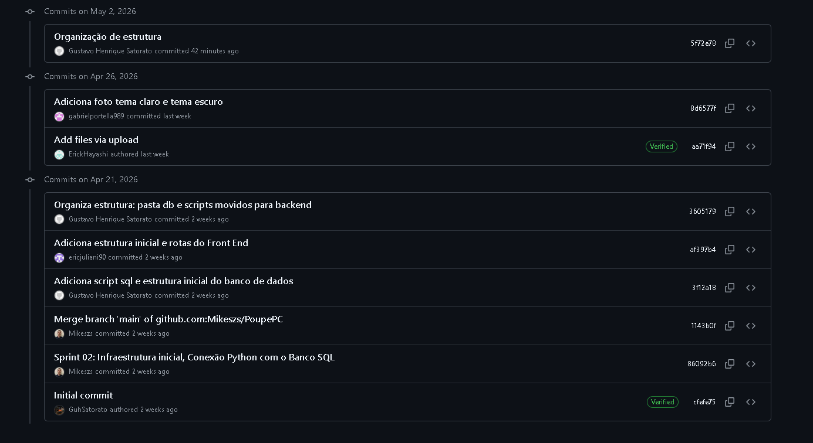

# 🔀 Desenvolvimento vs Produção — PoupePC

Documento que explica a estratégia de separação entre os ambientes de **desenvolvimento** e **produção** do projeto.

---

## 1. Estratégia de Branches (Git Flow)

Utilizamos uma adaptação do modelo **Git Flow** para organizar o desenvolvimento:

```
main (Produção)
 │
 └── develop (Desenvolvimento)
      │
      ├── feature/login-system
      ├── feature/sqlite-setup
      ├── feature/busca-componentes
      └── feature/filtros-avancados
```

### 🟢 `main` — Produção

- Contém o código **100% estável e testado**
- Somente o código que foi aprovado em todas as etapas de desenvolvimento é mesclado (merge) aqui
- É a branch que o professor deve considerar como o **"produto final"** de cada Sprint

### 🔵 `develop` — Desenvolvimento

- É a **branch de integração**
- Todo código de novas funcionalidades passa por aqui primeiro
- Reflete o estado atual do projeto para a próxima entrega

### 🟣 `feature/*` — Funcionalidades

- Branches **temporárias** criadas para tarefas específicas
- Exemplos: `feature/login-system`, `feature/sqlite-setup`
- Após a conclusão da tarefa, a branch é mesclada em `develop` e excluída

---

## 2. Fluxo de Trabalho (Workflow)

O ciclo de desenvolvimento segue as etapas abaixo:

```
1. Criar branch    2. Desenvolver     3. Push         4. Pull Request    5. Merge
   feature/xyz  ──▶  + Commits   ──▶  para GitHub ──▶  para develop  ──▶  na main
                     locais                            + Code Review      (fim da Sprint)
```

1. O membro da equipe **cria uma branch** a partir da `develop`
2. **Desenvolve a funcionalidade** e realiza os commits locais
3. Faz o **push** da branch para o GitHub
4. Abre um **Pull Request (PR)** para a branch `develop` com revisão dos pares
5. Ao final da Sprint, a `develop` é **mesclada na `main`** para a entrega oficial

---

## 3. Ambientes de Execução

| Ambiente | Descrição | Banco de Dados | Status |
|----------|-----------|---------------|--------|
| **🖥️ Local (Desenvolvimento)** | Ambiente de desenvolvimento individual de cada membro | `poupe_pc.db` (SQLite) gerado automaticamente pelo script Python | ✅ Ativo |
| **🌐 Produção** | Ambiente preparado para rodar em servidores (Web/Mobile) | MySQL/PostgreSQL com configurações de segurança finais | 📋 Planejado |

### Diferenças entre os ambientes

| Aspecto | Desenvolvimento | Produção |
|---------|----------------|----------|
| **Banco de Dados** | SQLite (arquivo local) | MySQL/PostgreSQL (servidor) |
| **Debug Mode** | Ativado | Desativado |
| **Dados** | Dados de teste | Dados reais |
| **Acesso** | Local (localhost) | Servidor público |
| **Segurança** | Configurações básicas | HTTPS, autenticação robusta |

---

## 4. Evidências

A imagem abaixo mostra o fluxo de branches do repositório:

