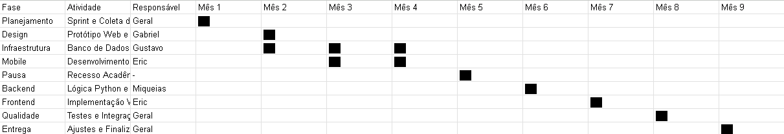

# 📋 Quadro Kanban — PoupePC

Utilizamos o quadro Kanban para acompanhar o progresso das tarefas em cada Sprint, garantindo visibilidade sobre o que precisa ser feito, o que está em andamento e o que já foi concluído.

---

## 🛠️ Ferramenta Utilizada

- **Trello** — Quadro de acompanhamento principal da equipe

---

## 📊 Estrutura do Quadro

O quadro está organizado nas seguintes colunas:

| Coluna | Descrição |
|--------|-----------|
| **📋 Backlog** | Tarefas identificadas mas ainda não priorizadas para a sprint atual |
| **📌 To Do** | Tarefas priorizadas e prontas para iniciar na sprint |
| **🔄 In Progress** | Tarefas em desenvolvimento ativo por um membro da equipe |
| **🔍 Review** | Tarefas finalizadas aguardando revisão de código ou aprovação |
| **✅ Done** | Tarefas concluídas, testadas e aprovadas |

---

## 📸 Evidência

### Quadro Kanban — Sprint 02

---

## 🔗 Link de Acesso

- **Trello:** [Acessar quadro PoupePC](https://trello.com/invite/b/69f6134bb4143f255f4241d0/ATTI8fe2152c7f7479cf011278edd0af6818127A3401/poupepc)

---

## 📋 Snapshot das Tarefas (Sprint 02)

| Tarefa | Responsável | Status |
|--------|------------|--------|
| Configuração do repositório GitHub | Erick | ✅ Done |
| Prototipação de telas Web/Mobile | Gabriel | ✅ Done |
| Implementação do banco SQLite | Gustavo | ✅ Done |
| Sistema de login (back-end) | Miqueias | ✅ Done |
| Interface de busca de componentes | Eric J. | 🔄 In Progress |
| Documentação da Sprint 02 | Erick | 🔄 In Progress |
| Filtros por categoria de hardware | Eric J. | 📌 To Do |
| Integração front-end com banco | Miqueias | 📌 To Do |